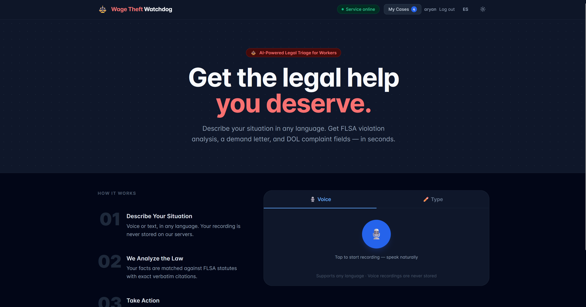
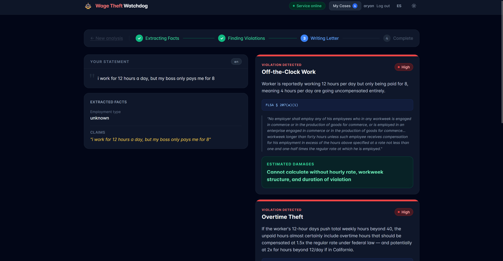
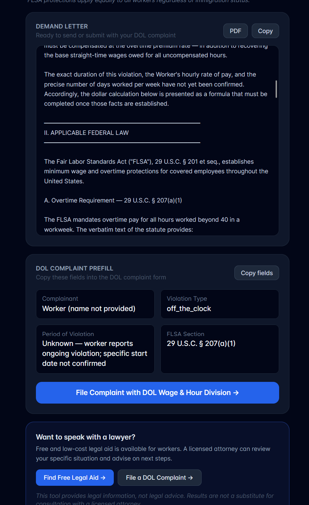

# ⚖️ C-LAWD — Claude-Leveraged AI for Worker Defense

**AI-powered legal triage for wage theft victims.** Describe your situation by voice or text, in any language — get FLSA violation analysis, verbatim law citations, estimated damages, and a ready-to-send demand letter in seconds.

Built for the **Claude Hackathon — Track 1: Economic Empowerment & Education.**

🎬 **[Watch the demo](https://youtu.be/JLR3TiGKWLo)**

---

## Quick Start

### Requirements
- Python 3.11+
- Node 18+
- API keys: [Anthropic](https://console.anthropic.com/settings/keys), [OpenAI](https://platform.openai.com/api-keys), [Groq](https://console.groq.com/keys)

### 1 — Environment

```bash
cp .env.example .env
# Fill in ANTHROPIC_API_KEY, OPENAI_API_KEY, GROQ_API_KEY, JWT_SECRET
```

### 2 — Backend

```bash
cd backend
uv venv && uv pip install -r requirements.txt
cd ..
.venv/Scripts/uvicorn backend.main:app --port 8000   # Windows
# or
.venv/bin/uvicorn backend.main:app --port 8000        # Mac/Linux
```

> First start embeds the FLSA corpus into ChromaDB (~15 seconds). Subsequent starts skip this.
> Verify with: `curl http://localhost:8000/health` → `{"ok": true}`

### 3 — Frontend

```bash
cd frontend
npm install
npm run dev
```

Open [http://localhost:5173](http://localhost:5173)

---

## Screenshots







---

## How It Works

C-LAWD runs your situation through a four-stage AI pipeline:

```
Voice / Text
    ↓  Groq Whisper
Transcript
    ↓  Claude Haiku
Structured Facts  (employer, hours, wage rate, claims)
    ↓  ChromaDB + Claude Sonnet
Violations  (with verbatim FLSA citations + damages estimate)
    ↓  Claude Sonnet
Demand Letter + DOL Complaint Form
```

Every violation is backed by an **exact quote from the statute** — no paraphrasing, no hallucination.

---

## Example Scenarios

### 🕐 Overtime Theft
> *"I work 60 hours a week at Riverside Factory but my boss only pays me for 40. My hourly rate is $15."*

**Detected:** Overtime theft — FLSA § 207(a)(1)
**Damages:** $225/week unpaid overtime × weeks worked
**Output:** Demand letter citing 29 U.S.C. § 207 + DOL complaint pre-filled

---

### 💸 Tip Skimming
> *"I'm a server at Downtown Grill. My manager takes half our tips at the end of every shift. My base wage is $2.13/hr."*

**Detected:** Tip skimming — FLSA § 203(m)
**Output:** Letter demanding tip restitution + explanation of tip credit rules

---

### 🏷️ Misclassification
> *"Metro Delivery calls me an independent contractor but I work set hours, use their van, wear their uniform, and they control my route."*

**Detected:** Worker misclassification
**Output:** Letter arguing employee status under the economic reality test

---

### 💰 Minimum Wage Violation
> *"My boss pays me $5 an hour and says minimum wage laws don't apply to small businesses. I work 40 hours a week."*

**Detected:** Minimum wage violation — FLSA § 206
**Damages:** $2.25/hr × 40 hrs = $90/week owed

---

### ⏰ Off-the-Clock Work
> *"Every day I have to come in 30 minutes early to stock shelves before I clock in, and stay 20 minutes after. That's about 4 unpaid hours a week at $14/hr."*

**Detected:** Off-the-clock wage theft — FLSA § 254
**Damages:** $56/week × weeks worked

---

## Features

- 🎙️ **Voice or text input** — any language, powered by Groq Whisper
- ⚖️ **Verbatim legal citations** — exact statute quotes, never paraphrased
- 📄 **Demand letter** — ready to send, includes damages calculation
- 🏛️ **DOL complaint pre-fill** — form fields auto-populated from your case
- 💾 **Case history** — save and revisit past analyses (requires account)
- 🌐 **EN / ES** — full Spanish UI toggle
- 🔒 **Privacy-first** — voice recordings never stored, sessions ephemeral

---

## Stack

| Layer | Technology |
|-------|------------|
| Frontend | Vite + React + Tailwind CSS |
| Backend | FastAPI (Python) |
| Transcription | Groq `whisper-large-v3-turbo` |
| Fact extraction | Claude Haiku 4.5 |
| Legal analysis + letter | Claude Sonnet 4.6 (with prompt caching) |
| Vector search | ChromaDB + OpenAI `text-embedding-3-small` |
| Auth | bcrypt + JWT (SQLite) |
| Rate limiting | slowapi (10 req/min per IP) |

---

## Bias & Fairness

We built a 30-variant demographic audit (`scripts/bias_test.py`) that runs the same legal facts through different demographic signals — worker names across ethnicities, language registers, immigration status, industry, gender, and age — and checks that violation detection, severity, and damages are consistent across all variants.

FLSA protects **all workers** regardless of immigration status. The app surfaces this explicitly whenever immigration is raised.

---

## Privacy

- Voice recordings are processed in memory and **never written to disk**
- Transcripts are never logged or sent to analytics
- The backend is stateless — no data retained between requests unless you're logged in
- Logged-in users' cases are stored locally in SQLite and can be deleted at any time

---

## Legal Disclaimer

This tool provides **legal information**, not legal advice. It is not a substitute for consultation with a licensed attorney. Always consult a lawyer for your specific situation.

---

*Built by Aryan & Renee at the Claude Hackathon UCSD.*
